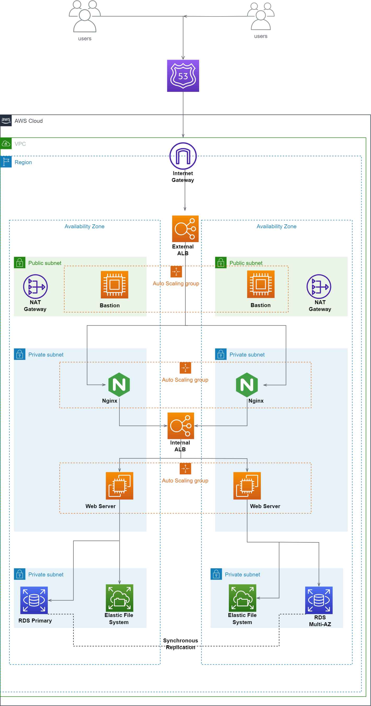

# AWS_Terraform_3tier_app
Code to deploy a 3 tier web application in AWS using Terraform

## Project Design Architecture Diagram
  

## Prerequisites For Implementing the project
- AWS Account

    If you do not currently have an aws account you can open [here](https://aws.amazon.com/resources/create-account/)

- Terraform

    If you don't have terraform installed on your machine, you can follow this [documentation](https://developer.hashicorp.com/terraform/tutorials/aws-get-started/install-cli) to setup terraform 

- AWS CLI

    You can follow this [AWS Documentation](https://docs.aws.amazon.com/cli/latest/userguide/getting-started-install.html) to install or update to the latest version of AWS CLI

## SetUp
Login to your [AWS account](https://aws.amazon.com) and navigate to the IAM Dashboard to create an IAM User. Assign administrator access permissions to the user and be sure to download and save your access keys.

